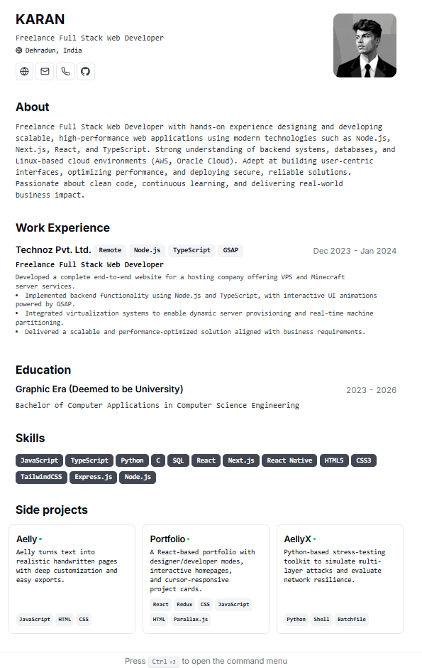

# Ansh's Resume & Portfolio



A professional digital resume and portfolio built with **Next.js**, **React**, and **TypeScript**. Designed for performance, print-friendliness, and a clean reading experience.

## 🚀 Tech Stack

*   **Framework:** [Next.js](https://nextjs.org/) (React)
*   **Styling:** [Tailwind CSS](https://tailwindcss.com/)
*   **Language:** [TypeScript](https://www.typescriptlang.org/)
*   **UI Components:** [shadcn/ui](https://ui.shadcn.com/)

## ✨ Features

*   **Responsive Design:** Optimized for mobile, tablet, and desktop views.
*   **Print Friendly:** content formatting when printing to PDF.
*   **Dark/Light Mode:** Automatically adapts to system preferences.
*   **Performance:** Fast load times with Static Site Generation.

## 🛠️ Getting Started

1.  **Install dependencies:**

    ```bash
    npm install
    ```

2.  **Run the development server:**

    ```bash
    npm run dev
    ```

3.  Open [http://localhost:3000](http://localhost:3000) in your browser.

## 📝 Configuration

Edit `src/data/resume-data.tsx` to update:
*   Personal Details
*   Work Experience
*   Education & Skills
*   Projects

## 📄 License

This project is open source and available under the [MIT License](LICENSE).
